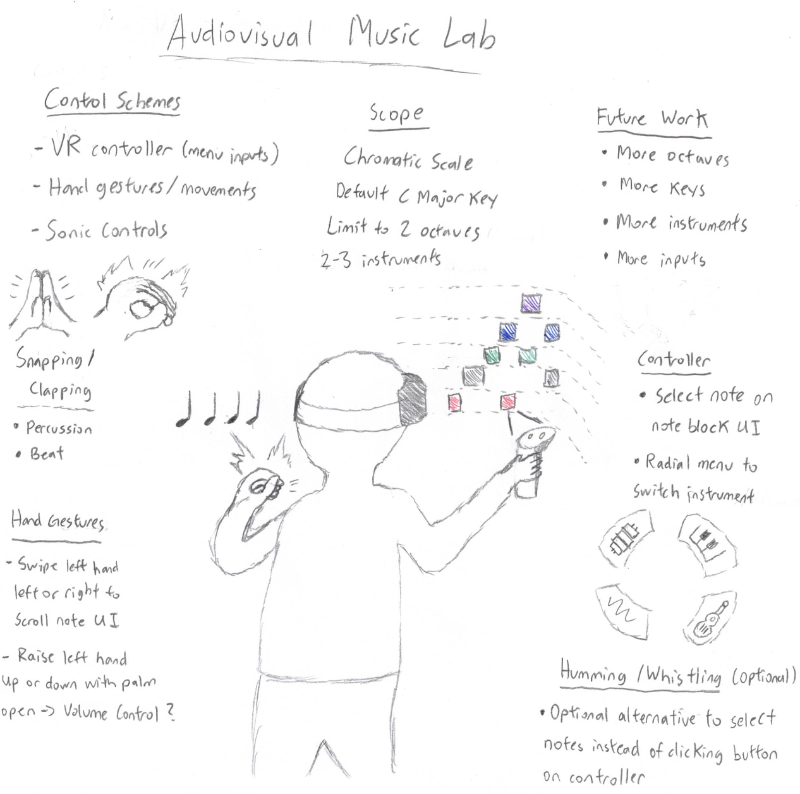

---
# Extends metadata from _quarto.yml
subtitle: "Individual Repository"
date: 2026-09-04
---

# Contents
Audio Interactive Presentation

# Project Idea Reminder

{width=700}

# Goal for Audio Presentation
- Map keys on keyboard to keys on piano
- Be able to play C major
- Switch between octaves
- Volume control

# Demo of Plugdata Keyboard 
- Plugdata detects ASCII keycode of keyboard press
- Map ASCII keycode to corresponding MIDI note number
- MIDI transformation (octave change, volume change)
- Plugdata sends MIDI output to sforzando through virtual MIDI port 
- sforzando converts MIDI instruction to piano sample audio

# Reuse and Extend
- Reuse logic of mapping different note blocks to corresponding MIDI values
- Reuse midi transformations (just adding/subtracting midi value) for audio transformations 
- Future work: Add black keys, different scales, try with different virtual instruments